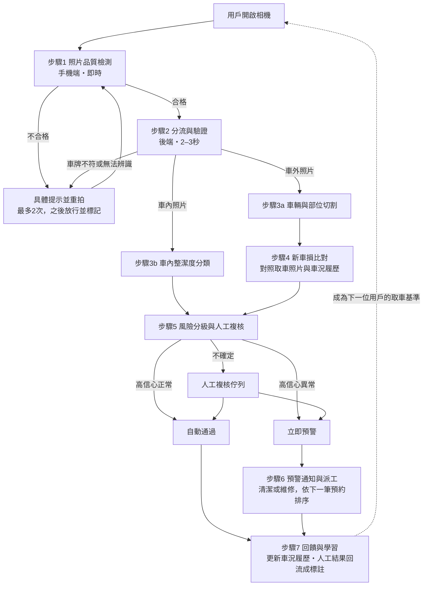

# iRent 智能車況管家：系統 Workflow

> 2026 和泰 AI 黑客松｜運用 AI 打造 iRent 智能車況管家：優化租還車體驗與營運效率
> 版本：v0.1（2026-10-02）

---

## 0. 設計原則

1. **預防勝於校正**：在拍照當下就把照片品質做好，後端 AI 才會準。
2. **依速度分層**：用戶要等的檢查放在手機上跑（5 秒內回饋）；重型分析放在背景，不讓用戶等。
3. **AI 給風險分數，人做最後決定**：索賠牽涉到錢和爭議，AI 只負責篩選和標示，由人確認。
4. **車況接力**：上一手的還車照片，就是下一手的取車基準。每台車都有一份持續更新的車況履歷。

---

## 1. 從資料觀察到的現況問題（簡報論據）

| 觀察 | 證據 | 對方案的影響 |
|---|---|---|
| 上傳分類常常是錯的 | README 明確說明；例如第 108 組的車內欄位拍的是車頂、第 205 組的車內欄位是車尾外觀 | 不能相信用戶選的欄位，要依照片實際內容分流 |
| 照片品質不穩定 | 全黑的夜拍、橫躺沒轉正、過曝、模糊 | 需要即時防呆（步驟 1） |
| 取車沒有拍車內 | 500 組的取車照都只有 01–04 加車損補拍，車內照（10、11）只在還車時拍 | 「承接上一手髒亂車」目前無法證明 → 用車況接力解決 |
| 車本來就有舊傷 | 約 39% 的取車有補拍車損（05 之後的照片） | 新車損必須和車況履歷比對 |
| 取車可以略過拍照 | 取車流程圖中有「已確認車況正常，同意使用，選擇略過拍照」 | 比較基準可能不存在 → 用車況履歷和上一手的還車照片補位 |
| 借車和還車的照片角度不一致 | 索賠資料中的成對照片，角度、距離、光線都不同 | 整張照片的相似度比對不可行 → 改用部位比對＋框線引導統一角度 |
| 還車常在地下停車場 | 還車流程有「停車場還車」 | 手機端的檢查必須能離線運作 |

---

## 2. 整體流程圖

---

## 3. 各步驟說明

### 步驟 1：照片品質檢測（手機端｜對應環節一）

**拍照前（即時）**
- 依訂單車號載入對應車型的框線（Yaris、Corolla Cross、Altis、Prius c… 各有不同輪廓）
- AI 即時偵測車輛位置，和框線重疊夠多時，框線由紅轉綠
- 四個條件都滿足就自動拍照：對準、清楚、亮度足夠、看得到車牌
- 進階：半透明疊上「上一位用戶的還車照片」，讓角度一致
- 取車時在框線上顯示已登記的舊傷位置：「這裡已有登記的刮痕，不用另外拍」

**按下快門後（1 秒內）**
- 模糊偵測（拉普拉斯變異數）
- 亮度與曝光（亮度直方圖）
- 車輛在畫面中的比例（判斷太遠或太近）
- 有沒有拍到車牌
- 方位初判（手機上的輕量分類模型）

**回饋設計**
- 提示要說清楚怎麼改：「車牌被擋住了，請往右移一步」、「太暗了，請開閃光燈」
- 沿用現有 App 的縮圖列：每張照片檢查完，在縮圖上打綠勾或黃色驚嘆號
- 重拍上限 2 次，之後放行並在後台標記為「低品質」
- 停車空間太窄時：自動切換超廣角，或提供「空間不足」選項放寬標準
- 必須能離線運作（地下停車場）

### 步驟 2：分流與驗證（後端｜對應環節一）

- 依照片**實際內容**判斷：車外（左前、右前、左後、右後）、車內（前座、後座）、車損近照、其他
- 車牌辨識，確認和訂單車號相符（防止拍錯車）
- 照片方向自動轉正

### 步驟 3a：車輛與部位切割（後端｜對應環節二-1）

- 把車從背景切出來（YOLO-seg 或 SAM）
- 再切出車體部位：前後保險桿、前後葉子板、車門、引擎蓋、後車廂、車燈
- 部位是後面比對和通知的基本單位

### 步驟 3b：車內整潔度分類（後端｜對應環節二-2）

- 分成三類：**髒污（須立即清潔）／普通／乾淨**
- 偵測項目：垃圾、食物殘渣、污漬、遺留物品、菸蒂
- 「髒污」的界線依 iRent 的營運標準，由人先示範一批例子來定義
- 遺留物品可另外通知用戶取回（體驗加分）

### 步驟 4：新車損比對（後端｜對應環節二-1）

- 分別偵測這次取車和還車照片裡的損傷（刮痕、凹陷、破裂、掉漆）
- 依部位配對：**還車時有、取車時沒有、車況履歷也沒有的**，才算「疑似新車損」
- 如果取車時略過拍照：改用上一位用戶的還車照片和車況履歷當基準
- 輸出：疑似新車損的位置、框線、風險分數，不直接判定賠償

### 步驟 5：風險分級與人工複核（後端＋人｜對應環節二-3）

| AI 判斷 | 處理方式 | 人的角色 |
|---|---|---|
| 高信心：正常 | 自動通過 | 不介入（目標是大部分訂單都在這層） |
| 中信心：不確定 | 進人工複核佇列 | 看取車與還車照片並排對照＋AI 標示的框，30 秒內判斷 |
| 高信心：異常 | 立即預警 | 營運人員確認後才進入索賠流程 |
| 用戶申訴 | 轉客服 | 客服查看完整的車況紀錄 |

- 背景分析發現疑似問題時，趁用戶還在車旁（1–2 分鐘內）推播「請補拍左後門近照」
- 還車流程最後的「提供停車位置」步驟，可以爭取這段分析時間

### 步驟 6：預警通知與派工（營運後台｜對應環節三）

- **整備調度看板**：地圖上用顏色標出每台車的狀態（需清潔／疑似車損／正常）
- **自動派工**：依下一筆預約的時間排優先順序，透過 LINE 或推播通知整備人員
- **結案**：整備人員完成清潔或維修後拍照結案，車況履歷同步更新
- **髒車服務補救**：判定為髒污的車，先暫停接受預約，或讓下一位用戶選擇換車或領取折扣
- 客服即時看到同一份車況資訊，處理客訴時有完整依據

### 步驟 7：回饋與學習（後端｜創新加分）

- **車況接力**：這次的還車照片成為下一位用戶的取車基準；下一位用戶取車時可以看到「上一手的還車照，AI 已檢查過」，看到不一樣的地方可以一鍵回報
- **數位車況履歷**：每台車有一張車損地圖，記錄所有已登記的舊傷
- **持續學習**：人工複核的結果回流成標註資料，模型越用越準
- **誠實回報獎勵**：照片拍得好、主動回報車況的用戶給點數

---

## 4. 回饋時間設計（5 秒內）

| 層 | 在哪裡跑 | 速度 | 檢查內容 | 用戶要等嗎 |
|---|---|---|---|---|
| 第 0 層：拍照前 | 手機 | 即時 | 框線對位、太暗、太近太遠、手晃 | 不用，對準就自動拍 |
| 第 1 層：快門後 | 手機（輕量模型） | 1 秒內 | 模糊、方位、有沒有拍到車牌 | 幾乎不用 |
| 第 2 層：上傳後 | 雲端（快速模型） | 2–3 秒 | 車牌是否相符、方位再確認 | 等，但在 5 秒內 |
| 第 3 層：背景分析 | 雲端（重型模型） | 數十秒到幾分鐘 | 新車損比對、車內整潔度 | 不用等，結果送到營運後台 |

**做法**
- 能在手機上判斷的，就不上傳再判斷
- 拍一張傳一張：用戶走向下一個角落時，上一張已經在背景檢查完
- 即時檢查上傳縮小版（長邊約 1024 像素）；原始大圖在背景另外傳，給第 3 層和索賠存證用
- 第 2 層用小型偵測模型；多模態大模型回應較慢，留給第 3 層

**一張照片的時間估算**：壓縮約 0.2 秒 → 上傳約 0.5–1 秒 → 推論約 0.3 秒 → 回傳約 0.2 秒，合計約 1.5–2 秒。

**沒有訊號時**：第 0、1 層離線運作；照片先存在手機，有訊號再補傳，第 2 層結果改用推播通知。

---

## 5. 技術選型（初版）

| 用途 | 候選工具 | 備註 |
|---|---|---|
| 模糊、亮度 | OpenCV | 不需要 AI |
| 車輛偵測與切割 | YOLO-seg、SAM | 內建「car」類別，不用標註 |
| 車體部位切割 | Ultralytics carparts-seg 公開資料集 | 用公開資料訓練 |
| 用文字指定部位切割 | Grounding DINO + SAM | 不用標註，精準度較低 |
| 車牌辨識 | PaddleOCR | |
| 方位分類 | CLIP 零樣本分類，或 DINOv2 特徵分群後少量標註 | 手機版可蒸餾成輕量模型（TFLite / Core ML） |
| 車損偵測 | 用 CarDD 等公開車損資料集訓練 | 用公開資料訓練，用 iRent 索賠資料測試 |
| 車內整潔度 | CLIP 或多模態大模型 → 自行標註約 300 張微調 | |
| 手機端原型 | TensorFlow.js / MediaPipe | 網頁原型即可錄製 Demo |
| 標註工具 | Label Studio、Roboflow | AI 先標，人只負責修正 |

⚠️ **資料使用規範**：README 說明資料不得對外提供。若要將照片送到雲端大模型 API，需先寫信至 ht-hackathon@bhuntr.com 確認；否則改用本地模型。

---

## 6. 資料準備

**前處理**
1. 依 EXIF 轉正方向
2. 統一格式（png / jpg / jfif）與尺寸
3. 依照片實際內容重新分類，不使用檔名的 01–11 當答案
4. 挑出不能用的照片（全黑、嚴重模糊、重複），作為環節一的測試資料

**標註計畫（三人分工約 2–3 小時）**
- 方位分類：抽約 1,000 張，按鍵分類
- 車內整潔度：抽約 300 張車內照片，分成三類
- 車損：只標索賠資料那二十幾組，在損傷處畫框（作為測試集）

---

## 7. 成效指標

| 指標 | 對應痛點 |
|---|---|
| 照片第一次就合格的比例 | 體驗：拍錯、模糊 |
| 重拍率、每張照片平均拍攝時間 | 體驗：流程順暢度 |
| 上傳分類錯誤率（改善前 vs 改善後） | 營運：照片可用性 |
| 自動通過的訂單比例 | 營運：人工查看照片的負擔 |
| 新車損偵測的召回率與誤報率 | 營運：異常攔截 |
| 髒車從還車到完成清潔的時間 | 體驗：下一手承接髒車 |
| 車況相關客訴件數 | 體驗與營運 |

---

## 8. 待決事項

- [ ] 團隊分工確認（程式、模型、設計、簡報）
- [ ] 寫信向主辦單位確認雲端 API 的使用是否符合資料規範
- [ ] 定義「髒污／普通／乾淨」的判斷標準
- [ ] 決定初賽影片的 Demo 範圍（建議：步驟 1 的框線引導＋即時回饋）
- [ ] 跑完 500 組照片的健檢，取得簡報需要的統計數字

## 9. 時程（截止：10/14 13:00）

| 日期 | 工作 |
|---|---|
| 10/2–10/4 | 定案方案、標註一小批照片、算出關鍵統計數字 |
| 10/5–10/9 | 做出品質檢查與整潔度的小 Demo＋營運看板的示意畫面 |
| 10/10–10/12 | 寫完 15 頁簡報（依模板七大架構）、拍 3 分鐘影片 |
| 10/13 | 檢查與緩衝；影片上傳 YouTube 設為「不公開」，標題格式為「iRent_作品名稱_2026和泰AI黑客松」 |
